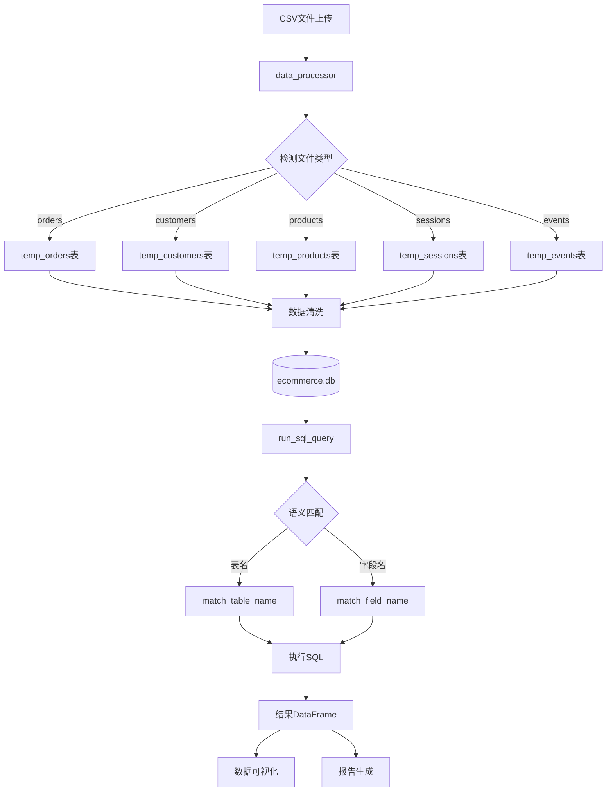

# AutoDA-Agent 电商分析助手

## 项目简介

AutoDA-Agent是一个基于Python + Streamlit + LangChain的智能电商数据分析助手，基于六阶段工作流架构实现企业级商业分析，支持多数据源接入、配置化管理、数据脱敏和缓存加速。

## 核心功能

- **六阶段工作流**：需求诊断 → 字段分析 → 数据获取 → 深度诊断 → 方案输出 → 效果追踪
- **多数据源支持**：SQLite、MySQL、PostgreSQL、ClickHouse 等企业级数据库
- **智能分析**：通过大模型理解用户需求，自动调用分析工具
- **快速分析**：提供转化漏斗、A/B测试结果、RFM用户分层等快速分析功能
- **数据可视化**：根据分析需求自动生成柱状图、折线图、饼图、漏斗图等交互式图表
- **配置化管理**：通过 config.yaml 统一管理所有配置
- **数据脱敏**：对敏感字段（手机号、邮箱、订单号等）自动脱敏
- **缓存加速**：Redis 缓存高频查询结果

## 技术栈

- **前端**：Streamlit
- **后端**：Python
- **数据处理**：Pandas、SQLite
- **统计分析**：SciPy、StatsModels
- **可视化**：Plotly
- **大模型集成**：LangChain、OpenAI API格式（支持DeepSeek等）
- **缓存**：Redis

## 数据处理流程图



## 项目结构

```
autoda_agent/
├── app.py                      # Streamlit主应用入口
├── workflow.py                 # 六阶段工作流管理器（主工作流）
├── analysis_workflow.py        # 模块化工作流（备用）
│
├── 报告生成/
│   ├── reporter.py             # LLM JSON报告生成
│   └── report_generator.py     # Markdown综合报告生成
│
├── 数据校验与分析/
│   ├── guardrail.py            # 数据需求匹配校验
│   ├── field_semantic.py       # 字段语义分析
│   ├── root_cause_analysis.py  # 根因分析
│   └── data_qa.py              # 数据质量检测
│
├── 工具模块/
│   ├── tools.py                # SQL查询和可视化图表
│   ├── data_processor.py       # 数据处理和数据库写入
│   └── agent.py                # LangChain LLM代理
│
├── 辅助模块/
│   ├── context_agent.py         # 用户意图澄清
│   ├── metric_tree.py          # 业务指标体系
│   ├── roi_calculator.py        # ROI计算
│   └── tracking.py             # 绩效追踪
│
├── 企业级模块/ (新增)          # 企业级功能增强
│   ├── config_loader.py        # 配置管理
│   ├── data_masking.py         # 数据脱敏
│   ├── redis_cache.py          # Redis缓存
│   ├── sql_dialect_adapter.py  # SQL方言适配
│   └── data_connector/         # 数据连接器
│       ├── __init__.py
│       ├── base_connector.py   # 连接器基类（带重试）
│       └── sqlite_connector.py # SQLite连接器
│
├── 备用工作流/
│   ├── workflow_core.py        # 核心组件
│   ├── sql_generator.py        # SQL生成
│   ├── analysis_executor.py    # 分析执行
│   └── visualization_planner.py # 可视化规划
│
├── Docker部署/ (新增)
│   ├── Dockerfile              # Docker镜像构建
│   ├── docker-compose.yml      # Docker服务编排
│   ├── wait-for-it.sh          # 服务依赖等待脚本
│   └── init.sql                # MySQL初始化脚本
│
├── config.yaml                 # 配置文件
├── data/
│   └── data1/                  # CSV原始数据
│       └── *.csv
│
└── ecommerce.db                # SQLite数据库
```

## 六阶段工作流

### 阶段1️⃣：需求诊断与目标对齐
- 调用 `context_agent.clarify_requirement()` 解析用户输入
- 调用 `metric_tree.build_metric_tree()` 构建业务指标体系

### 阶段2️⃣：字段语义分析与需求匹配
- 扫描数据库所有表的字段结构
- 调用 `field_semantic.analyze_field_semantics()` 分析字段语义
- 调用 `guardrail._check_data_match()` 校验数据是否支持需求

### 阶段3️⃣：数据获取与质检验证
- 根据analysis_type调用 `tools.run_sql_query()` 获取数据
- 调用 `data_qa` 模块进行质量检测
- 支持 Redis 缓存加速

### 阶段4️⃣：深度诊断与根因推演
- 调用 `root_cause_analysis.RootCauseAnalyzer.analyze_root_causes()` 生成根因洞察
- 根据analysis_type进行专项分析（渠道、支付、用户、产品、RFM等）

### 阶段5️⃣：方案输出与商业决策
- 调用 `reporter.generate_json_report_with_llm()` 生成LLM结构化报告
- 调用 `report_generator.generate_comprehensive_report()` 生成综合报告
- **数据可视化生成**：根据用户需求和数据分析类型自动生成图表

### 阶段6️⃣：效果追踪闭环
- 调用 `tracking.generate_performance_report()` 生成追踪配置

## 企业级功能

### 配置管理 (config_loader.py)
统一从 `config.yaml` 加载配置，支持：
- 数据库配置（类型、连接信息）
- LLM配置（公网/私有化切换）
- 缓存配置（Redis连接）
- 脱敏规则配置
- 重试策略配置

```python
from config_loader import load_config
config = load_config()
```

### 数据脱敏 (data_masking.py)
对敏感字段自动脱敏，支持配置化规则：
- 手机号：138****8888
- 邮箱：z**@example.com
- 订单号：ORD****2345

```python
from data_masking import DataMasker
masker = DataMasker()
masked_phone = masker.mask_phone("13812348888")
```

### Redis缓存 (redis_cache.py)
缓存高频查询结果，提升性能：
```python
from redis_cache import get_cache
cache = get_cache()
cache.set("query_key", dataframe, expire=3600)
result = cache.get("query_key")
```

### SQL方言适配 (sql_dialect_adapter.py)
支持多数据库SQL语法转换：
```python
from sql_dialect_adapter import SQLDialectAdapter
adapter = SQLDialectAdapter('mysql')
adapted_sql = adapter.adapt_sql("SELECT * FROM orders LIMIT 10 OFFSET 20")
# MySQL: LIMIT 20, 10
```

### 数据连接器 (data_connector/)
统一的数据源连接接口：
```python
from data_connector import SQLiteConnector
conn = SQLiteConnector({'path': 'ecommerce.db'})
conn.connect()
df = conn.execute_query("SELECT * FROM orders LIMIT 10")
```

## 数据可视化

当用户输入包含可视化相关关键词或分析类型需要可视化时，系统会自动：

1. **判断是否需要可视化**：检测关键词（图表、可视化、趋势、对比等）或分析类型
2. **筛选数据**：结合原始数据和二次处理数据
3. **选择图表类型**：柱状图、折线图、饼图、漏斗图、散点图等
4. **生成图表**：使用Plotly生成交互式图表

## Docker部署

### 快速启动
```bash
docker-compose up -d
```

### 启动服务
```bash
# 构建并启动所有服务
docker-compose up --build -d

# 查看服务状态
docker-compose ps

# 查看日志
docker-compose logs -f autoda-agent

# 停止服务
docker-compose down
```

### 环境变量配置
创建 `.env` 文件：
```bash
# LLM配置
LLM_MODE=public  # public / private
OPENAI_API_KEY=your-api-key
PRIVATE_LLM_URL=http://localhost:8000/v1

# 数据库配置
MYSQL_PASSWORD=autoda2024
MYSQL_DATABASE=autoda
```

## 环境搭建（本地开发）

1. **创建虚拟环境**
   ```bash
   python -m venv venv
   source venv/bin/activate  # Linux/Mac
   venv\Scripts\activate  # Windows
   ```

2. **安装依赖**
   ```bash
   pip install -r requirements.txt
   ```

3. **配置**
   ```bash
   cp config.yaml.example config.yaml
   # 编辑 config.yaml 设置数据库连接等配置
   ```

4. **运行应用**
   ```bash
   streamlit run app.py
   ```

## 依赖项

- streamlit
- pandas
- plotly
- langchain
- openai
- scipy
- statsmodels
- redis
- pyyaml

## 使用说明

1. **启动应用**：运行 `streamlit run app.py`
2. **选择分析模式**：标准分析 或 智能分析
3. **输入分析需求**：描述您的业务分析需求
4. **查看分析结果**：包含核心指标、深度洞察、业务建议和可视化图表

## 配置说明

### config.yaml 结构
```yaml
database:
  type: sqlite  # sqlite / mysql / postgresql / clickhouse
  path: ecommerce.db

llm:
  mode: public  # public / private
  api_key: ""

cache:
  enabled: true
  host: redis
  port: 6379
  expire_seconds: 3600

masking:
  enabled: true
  rules:
    phone:
      pattern: '^(\d{3})\d{4}(\d{4})$'
      replacement: '\1****\2'
```
